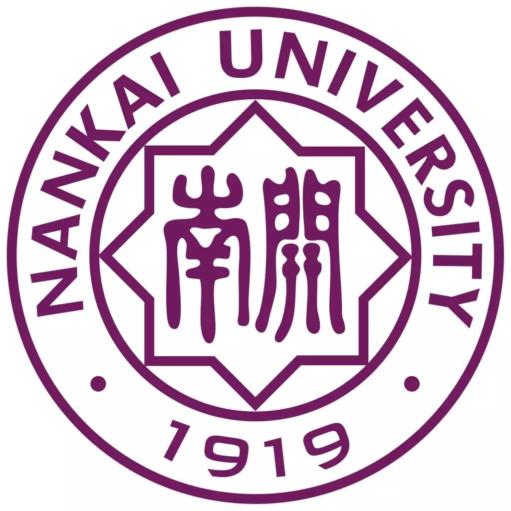

## 👤 About Me

I am a junior undergraduate student majoring in Computer Science and Technology at the College of Computer Science, Nankai University. My homepage records my education, research interests, publications, and projects.

## 🎓 Education

<table>
  <tr>
    <td>
      <ul>
        <li>
          <strong>Major in Computer Science and Technology</strong>
          &nbsp;
          📅2022.09 — 2026.06
          <ul>
            <li>
              <strong>College of Computer Science</strong>,
              Nankai University, Tianjin, China
            </li>
          </ul>
        </li>
      </ul>
    </td>
    <td align="center" valign="middle">
      
    </td>
  </tr>
</table>

## 🔬 Research Interest

* 👁️ Computer Vision
* 🖼️ Vision Language Models
* 🤖 Agent
* 🦾 Embodied AI

## 💬 Communication

I welcome discussions on undergraduate research, course projects, and future research directions. Feel free to connect with me through the following channels.

* 🌐 Website: https://hardenmyg.github.io/
* ✉️ Email: [2312388@mail.nankai.edu.cn](mailto:2312388@mail.nankai.edu.cn)
*  GitHub: [https://github.com/HardenMYG](https://github.com/HardenMYG)

---

> 💡 "The science of today is the technology of tomorrow."
> *Continue coding: `git push origin main`*

  

